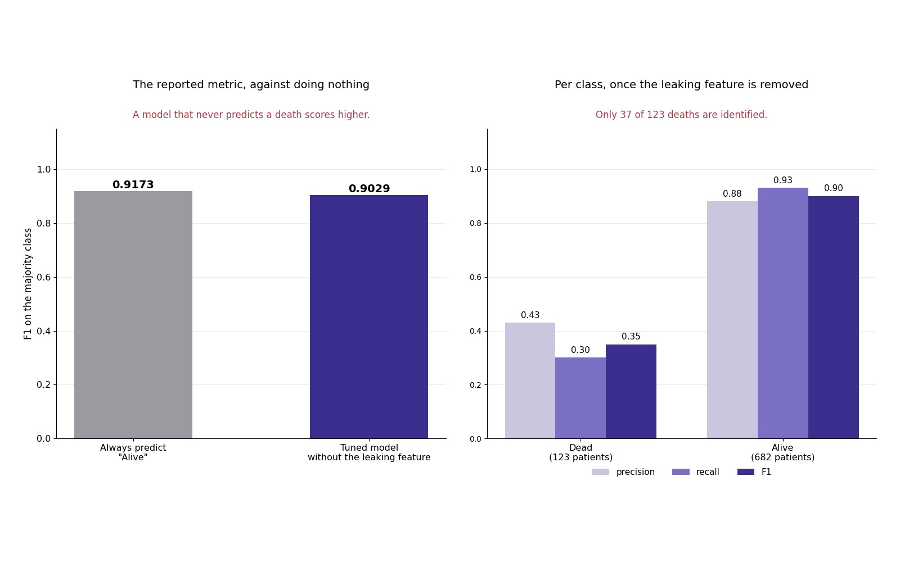

# Breast cancer survival classification

Binary survival-status classification on SEER breast cancer records, reported as a
negative result: the available clinical variables do not outperform a majority-class
baseline.

Machine Learning project, BSc in Artificial Intelligence — University of Pavia,
University of Milano-Bicocca, University of Milan.



*Left: reported metric against a majority-class baseline. Right: precision, recall and F1 per class.*

## Task

4,024 patient records, target `Status` (Alive / Dead), with 84.7% of patients alive —
a 5.5:1 class imbalance.

Features cover tumour stage (T, N, 6th stage, grade), tumour size, regional nodes
examined and positive, receptor status (estrogen, progesterone), A stage and age.
Race, marital status and differentiation were dropped after exploratory analysis.

**`Survival Months` is excluded from the feature set.** It records the number of months
following diagnosis, so it is not available at the moment a prediction would need to be
made, and it is the time component of the same survival outcome the model predicts.

## Method

`ColumnTransformer` with separate handling per feature type: mean imputation and
MinMaxScaler for age, mean imputation and StandardScaler for the remaining numerical
features, most-frequent imputation with ordinal encoding for the stage variables, and
one-hot encoding for the nominal ones. All transformers are fitted inside the
cross-validation folds.

SMOTE for the class imbalance, applied inside the pipeline so that resampling affects
only the training split of each fold.

Model selection by nested cross-validation over 112 configurations of dimensionality
reduction (none, PCA, LDA, sequential feature selection), classifier (SVC, logistic
regression, AdaBoost, others) and sampler.

## Results

| | F1 (majority class) |
|---|---|
| Always predict "Alive" | **0.9173** |
| Selected model | 0.9029 |

Per class, on the test set:

| | precision | recall | F1 | support |
|---|---|---|---|---|
| Dead | 0.43 | 0.30 | 0.35 | 123 |
| Alive | 0.88 | 0.93 | 0.90 | 682 |
| macro avg | 0.65 | 0.61 | **0.63** | 805 |

The model does not outperform a classifier that always predicts the majority class,
and identifies 37 of 123 deceased patients.

Three further observations point the same way. The selected regularisation parameters
are very small (C between 0.0018 and 0.0054), which flattens the decision boundary.
Each of the five outer folds selected a different pipeline, with F1 values differing by
about one point — no configuration holds a real advantage. And training and validation
F1 are nearly identical within each fold (0.9171 against 0.9173 in the first), where a
model that had fitted a decision boundary would normally score higher on its own
training data.

The clinical variables available in this dataset do not separate the two classes in
this formulation.

## Limitations

The task is framed as a cross-sectional binary classification, which does not handle
censoring: a patient recorded as alive may have died after the follow-up cutoff. A
better formulation predicts mortality at a fixed horizon — 36 or 60 months — excluding
patients censored before it, which is how the survival literature treats this data.

## Repository

```
notebooks/breast_cancer_survival.ipynb    EDA, pipeline, nested CV, evaluation
data/Breast_Cancer_Corrupted.csv          dataset with injected missing values
figures/                                  baseline comparison, per-class metrics
```

The dataset is a version of the public SEER breast cancer data with missing values
injected deliberately, used to exercise the imputation pipeline.
